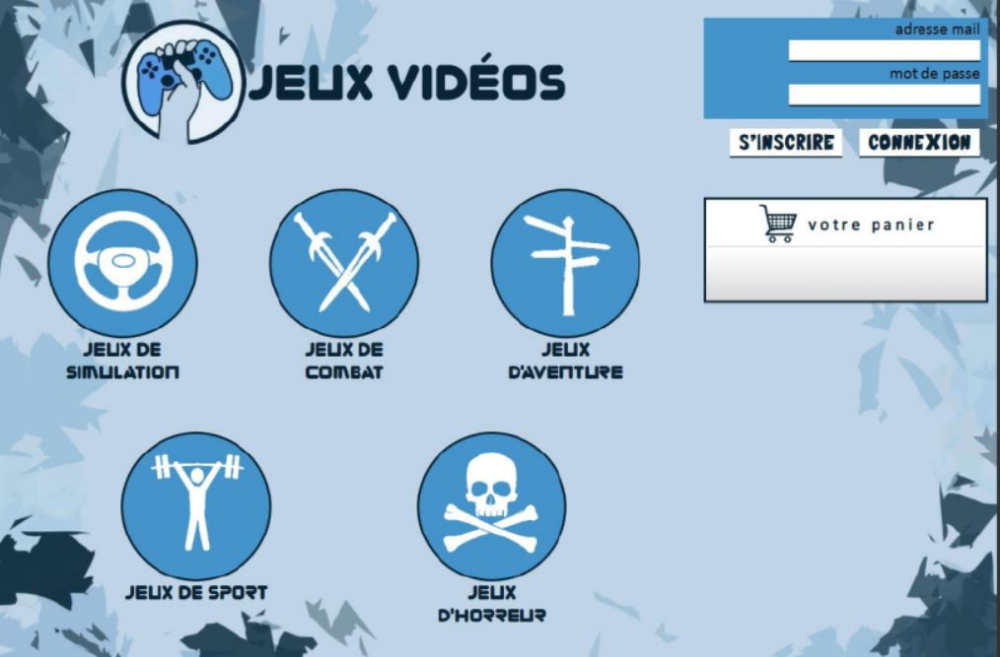

# Video_Games_WebSite
## Project: Video Game Purchase Platform

### Project Description

This project involves the development of an online platform dedicated to video game purchases. The main goal is to provide users with a user-friendly interface to explore, select, and purchase their favorite games effortlessly.

### Technologies Used

The website is built using the following technologies:
- PHP: Server-side programming language for business logic.
- HTML: Markup language for web page structure.
- CSS: Style sheet language for layout and visual presentation.
- MariaDB: Relational database management system for storing and managing website data.

### Features

1. **Game Catalog:** A comprehensive catalog of video games with detailed information about each title.

2. **Shopping Cart System:** Users can add games to their shopping cart and proceed to checkout.

3. **User Management:** Registration, login, and user account management for easy order tracking.

4. **Secure Payment Process:** Integration of a secure payment system to ensure reliable transactions.

5. **Search and Filters:** Advanced search and filtering features to help find specific games.

### How to Contribute

If you're interested in contributing to this project, feel free to clone the repository, create a branch, make changes, and then submit a pull request. We welcome any contributions aimed at improving and expanding the platform's functionalities.

### Installation

1. Clone the repository to your local machine.
   ```bash
   git clone https://github.com/YounesskOUROU/Video_Games_WebSite.git

### Overview


