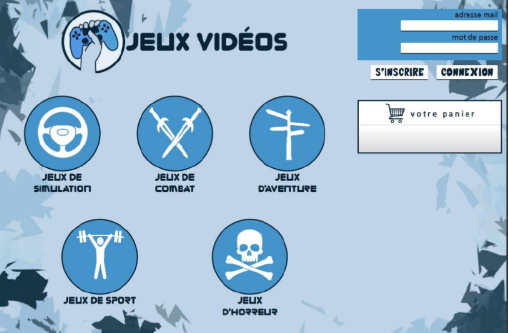

# Video_Games_WebSite
## Projet : Plateforme d'Achat de Jeux Vidéo

### Description du Projet

Ce projet consiste en le développement d'une plateforme en ligne dédiée à l'achat de jeux vidéo. L'objectif principal est de fournir aux utilisateurs une interface conviviale pour explorer, sélectionner et acheter leurs jeux préférés en toute simplicité.

### Technologies Utilisées

Le site web est construit en utilisant les technologies suivantes :
- PHP : Langage de programmation côté serveur pour la logique métier.
- HTML : Langage de balisage pour la structure de la page web.
- CSS : Langage de style pour la mise en page et la présentation visuelle.

### Fonctionnalités

1. **Catalogue de Jeux :** Un catalogue complet de jeux vidéo avec des informations détaillées sur chaque titre.

2. **Système de Panier :** Les utilisateurs peuvent ajouter des jeux à leur panier d'achat et passer à la caisse.

3. **Gestion des Utilisateurs :** Inscription, connexion et gestion des comptes utilisateurs pour un suivi facile des commandes.

4. **Processus de Paiement Sécurisé :** Intégration d'un système de paiement sécurisé pour garantir des transactions fiables.

5. **Recherche et Filtres :** Des fonctionnalités de recherche avancée et de filtres pour faciliter la découverte de jeux spécifiques.

### Comment Contribuer

Si vous souhaitez contribuer à ce projet, n'hésitez pas à cloner le référentiel, créer une branche, effectuer des modifications, puis soumettre une demande de tirage. Nous accueillons favorablement toute contribution visant à améliorer et à étendre les fonctionnalités de la plateforme.

### Installation

1. Clonez le référentiel sur votre machine locale.
   ```bash
   git clone https://github.com/YounesskOUROU/Video_Games_WebSite.git

### Vue génerale


